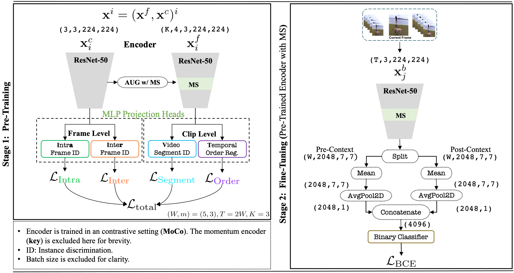
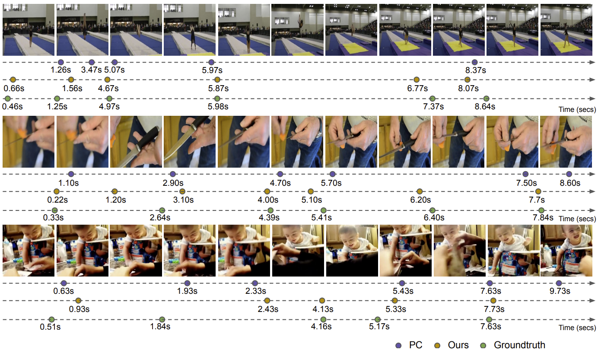

## Motion Aware Self-supervised learning for Generic Event Boundary Detection
The Code for "Motion Aware Self-Supervision for Generic Event Boundary Detection" will be uploaded here.

##### Pre-requisites

##### Running the code

##### Main Architecture
 

##### Visualisation of Motion Map learnt
 

##### Visualisation of the predicted boundaries
 

#### Credits
Our code has been largely borrowed from following repositories. 

[https://github.com/StanLei52/GEBD](https://github.com/StanLei52/GEBD)  
[https://github.com/amazon-science/video-contrastive-learning](https://github.com/amazon-science/video-contrastive-learning)  
[https://github.com/arunos728/MotionSqueeze](https://github.com/arunos728/MotionSqueeze)  